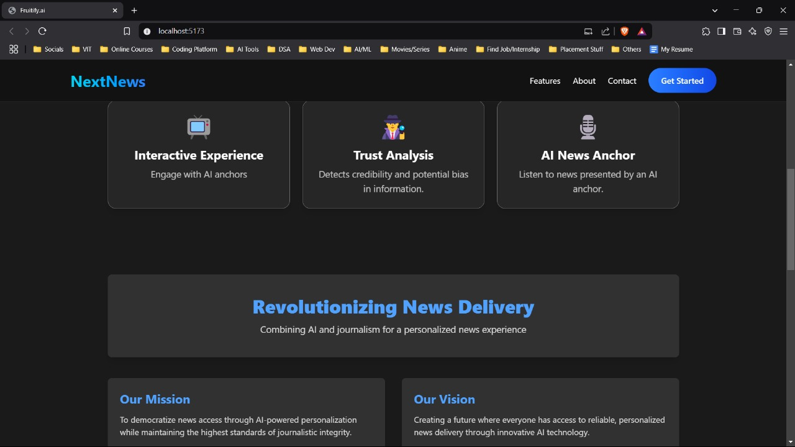

# NextNews
## Intelligent News Aggregation and Analysis Platform

A comprehensive platform that leverages artificial intelligence to analyze, categorize, and deliver personalized news content. This repository contains both frontend and backend components for a modern news application that uses natural language processing to enhance the news consumption experience.

## Project Overview




NextNews is designed to transform how users interact with news content by applying advanced AI techniques to:

- Aggregate news from multiple reliable sources
- Analyze sentiment and context in news articles
- Provide personalized news recommendations
- Visualize trends and patterns in news coverage
- Deliver real-time breaking news alerts

The project is structured with separate frontend (NextNews) and backend components, following modern web development architecture practices.

## Repository Structure

This repository is organized into the following main directories:

- **NextNews**: Frontend interface built with JavaScript, using Next.js framework
- **backend**: Python-based backend services for data processing and AI analysis

## Technology Stack

### Frontend 
- Next.js for the user interface
- Modern JavaScript frameworks for interactive visualizations
- Responsive design for cross-device compatibility

### Backend 
- Python-based API services
- Natural Language Processing (NLP) algorithms
- News data aggregation and processing systems
- AI/ML models for content analysis

## Getting Started

### Prerequisites

- Node.js (v14.x or later)
- Python (3.8 or later)
- Git

### Installation

1. Clone the repository:
   
```bash

git clone https://github.com/sa778888/newsai.git

cd newsai
```

2. Set up frontend:

```bash
cd NextNews

npm install

npm run dev
```


3. Set up backend:

```bash

cd backend

pip install -r requirements.txt

python app.py

```
4. Create necessary configuration files:
- Set up API keys for news sources
- Configure database connections
- Set environment variables

## Features

- **News Aggregation**: Collects articles from diverse sources
- **Sentiment Analysis**: Identifies emotional tone and bias in reporting
- **Topic Classification**: Categorizes news into relevant topics
- **Personalized Feed**: Tailors content to user preferences
- **Search Capabilities**: Finds relevant articles across sources
- **Visualization Tools**: Presents news trends graphically

## Development

This project follows a modular development approach with:

- Separation of frontend and backend concerns
- RESTful API architecture
- Data processing pipelines for news content
- AI model integration for advanced analysis

## Contribution Guidelines

Contributions to NewsAI are welcome! To contribute:

1. Fork the repository
2. Create a feature branch (`git checkout -b feature/amazing-feature`)
3. Commit your changes (`git commit -m 'Add some amazing feature'`)
4. Push to the branch (`git push origin feature/amazing-feature`)
5. Open a Pull Request

## License

This project is licensed under the Apache 2.0 License - see the LICENSE file for details.

## Acknowledgments

- News data providers
- Open-source NLP libraries
- AI research community
- Contributors and testers

## Contact

Repository Owner: [sa778888](https://github.com/sa778888)


